# CI Project 2

## Trivia Game
 
This app is a simple Trivia Game developed for casual entertainment and knowledge test.
The basic structure is comprised of HTML, CSS and Javascript and in the next sessions of this document you will learn a bit more about features and opportunities for further development.

## Features

### The main page
The main page is where it all starts with a very simplistic and confortable design, easy on the eyes and with intuitive functionality.

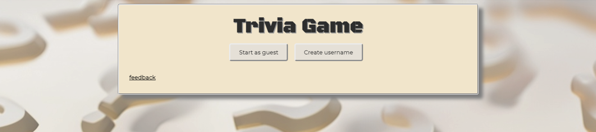

#### Functionality on this page
In the main page the player can avail of 3 buttons for interaction:

- Start as guest
- Create username
- Feedback

The functionality of these buttons will be described below.

### Start as guest
This button will start the game in guest mode, the player is not required to provide a username.
When this button is clicked, the game will load questions and options for answers as well as a Scoreboard that keeps the scores at view and constrols (at this stage only the "quit" control is available)

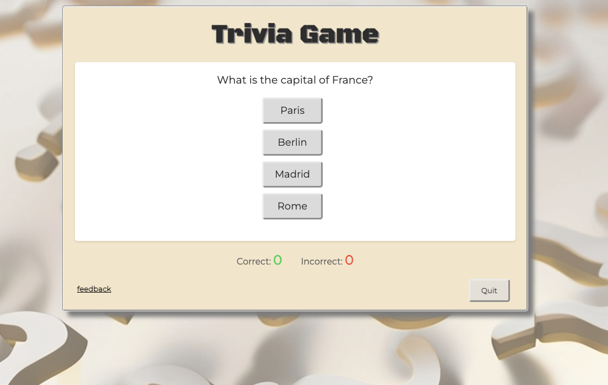

### Create username
Similar to the Start as guest button, this button will start the game but will first require the player to provide a username, a popup will appear with a field to type username and a button to submit. From this point the player will see the username on the top of the game board, just below the title Trivia Game.

- Create username area

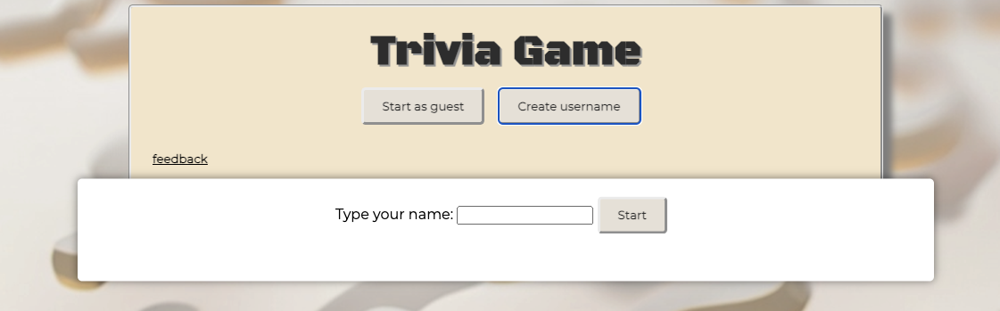

- Username displayed on the game board

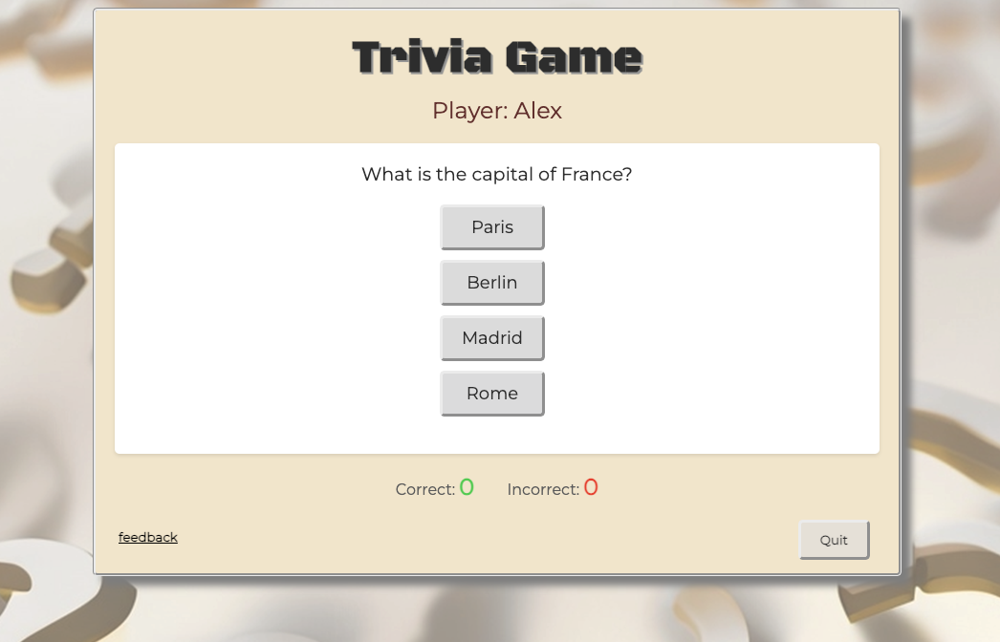

### Feedback
The feedback button allows the player to provide their ideas, suggestions and report issues if any are noticed. When clicking on the feedback button a feedback area will be expanded, the player can then type their feedback in the text area and submit by clicking on the submit button.
Upon clicking on the submit button, the player will see an alert message confirming the feedback has been submited. When clicking on the confirmation popup, the feedback area will retract and it can be accessed again by clicking on the feedback button once more.
Clicking on the feedback button repeatedly will expand and contract the feedback area.

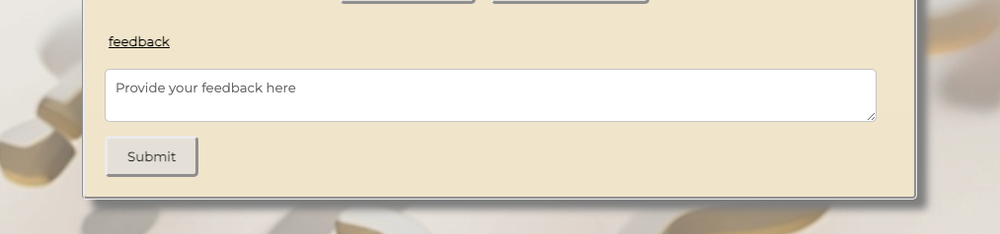

## Playing the game
While playing the game the player will be presented with questions and potential answers which they can choose by clicking on an answer button.
The game compares the clicked answer with the correct answer stored in the questions array, and displays a fun popup to let the player know if the answer is correct or incorrect.

- Correct answer

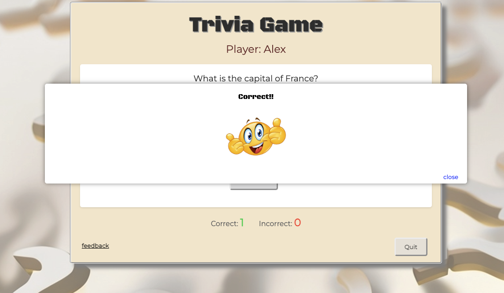

- Incorrect answer

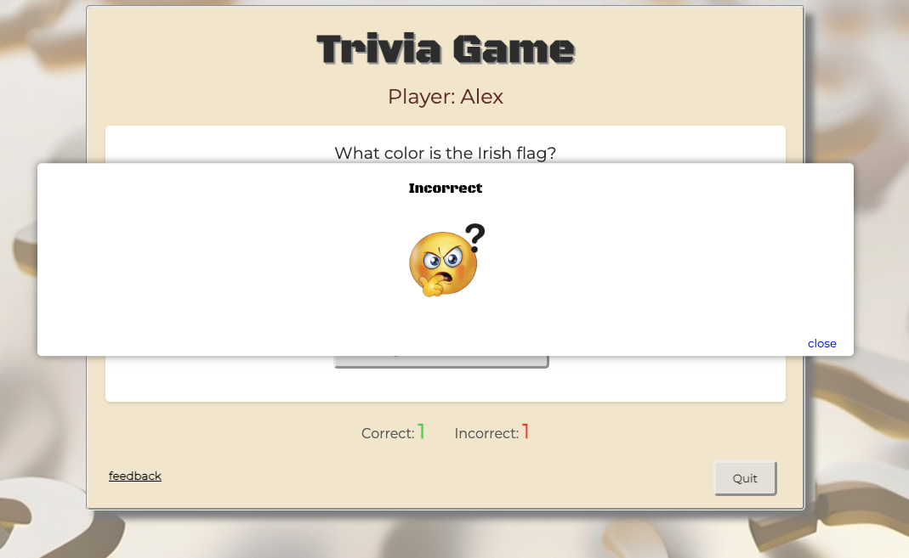

Both popups have a funny smiley face for visual afirmation and a close button that when clicked will lead the player to the next question.

The "quit" control is also available throughout the game while questions are presented to the player and if clicked, it will restart the game sending the player to the main page.

Providing feedback is also possible from any page on the game, the feedback button will be visible during the whole experience.

### Scoreboard
The scoreboard will keep track of correct/incorrect answers and a calculation is made at the end of the game to display the final result.

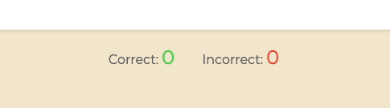

### Controls
Some control buttons will appear as the player proceeds. The "quit" control will send the player back to the main page, where they can start a new game either as a guest or providing a username.
The New Game control button will be displayed whenver a game is finished, the player has the option to click on this button and start a new game straight away, without having to go back to the main page.

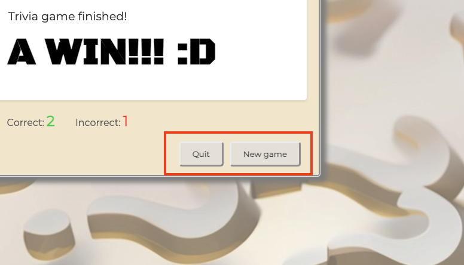

### Results
When all the questions are replied, the playwer will see a final message on the screen advising the game has finished along with a win or lost message.
In this screen the scoreboard is also displayed so the player can account for the result and message displayed.

- Win message

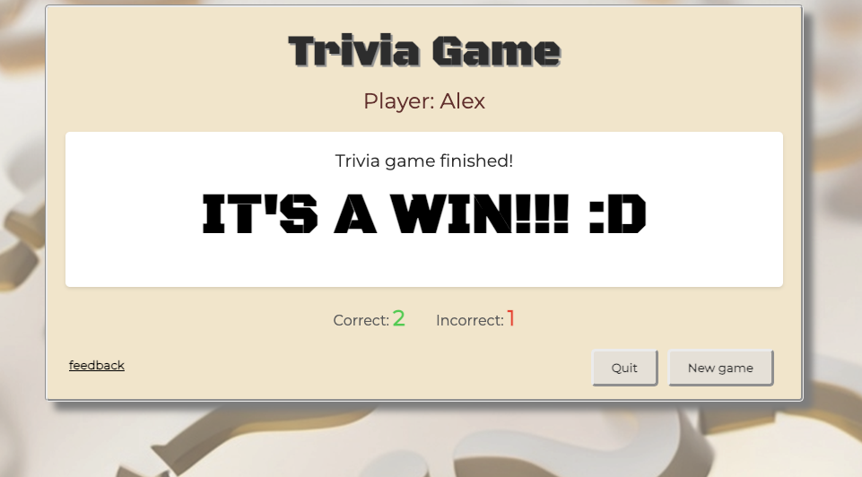

- Lost message

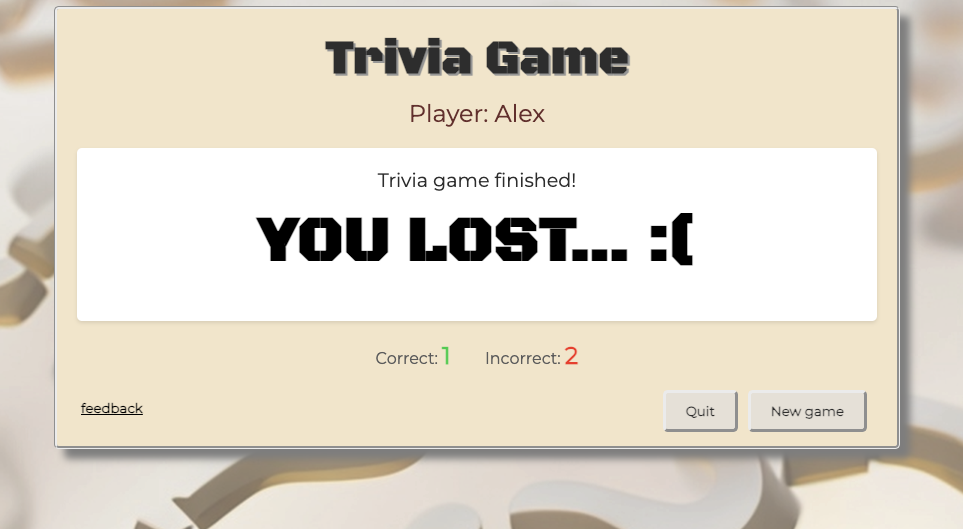

Whatever the result, the player can use the controls to Quit or start a New game as well as provide feedback.

## Bugs and resolution

### Pushing code to GitHub

When pushing commits to Git from Visual Studio Code, the following error may be perceived:

    `Enumerating objects: 75, done.
    Counting objects: 100% (75/75), done.
    Delta compression using up to 16 threads
    Compressing objects: 100% (51/51), done.
    error: RPC failed; HTTP 500 curl 22 The requested URL returned error: 500
    send-pack: unexpected disconnect while reading sideband packet
    Writing objects: 100% (69/69), 160.13 MiB | 5.99 MiB/s, done.
    Total 69 (delta 22), reused 0 (delta 0), pack-reused 0
    fatal: the remote end hung up unexpectedly
    Everything up-to-date`

The resolution was to set "git config http.postBuffer 524288000" as per post in Stack Overflow: [Git fails when pushing commit to GitHub](https://stackoverflow.com/questions/2702731/git-fails-when-pushing-commit-to-GitHub)

### Errors in the code found upon validation and fixed

#### Errors found in the index.html file:

1. Error:

Info: Trailing slash on void elements has no effect and interacts badly with unquoted attribute values.
From line 9, column 5; to line 9, column 76
lay">↩    <link rel="stylesheet" type="text/css" href="./assets/css/styles.css" />↩    <

- Fix: removed the unecessary slash

2. Error: 

Bad value for attribute src on element img: Must be non-empty.
From line 44, column 21; to line 44, column 85
↩

- Fix: added the source for one of the smily faces

## Testing

### User tests

The game was tested in the following browsers:
- Google Chrome - Version 116.0.5845.140 (Official Build) (x86_64)
- Moziela Firefox - 115.0.2 (64-bit)
- Safari - Version 16.5.2 (18615.2.9.11.10)

The tests conducted analysed the behaviour of all components, buttons and their functionalities in the game.

The game uses media query for responsiveness and has been tested in browser as well as the mobile screen simulation tool in DevTools of Chrome.

### Code Validation

Validation of the HTML code of the index.html was done by using [W3C Markup Validation Service](https://validator.w3.org/) and the code had a couple of erros tha have been fixed.

The style.css file was validated by [W3C CSS Validation Service](https://jigsaw.w3.org/css-validator/) and there were no errors found.

### Google Lighthouse test

Upon deployment to GitHub pages, the webpage was teseted with the Google Lighthouse tool available in the Dev tools kit of Google Chrome. All the marks achieved 100.

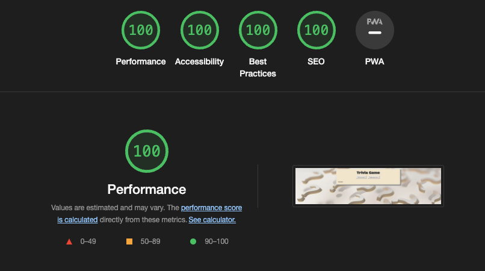

### Responsiveness

The game was built considering responsiveness so players can enjoy from their phones, computes, laptops or tablets. The responsiveness feature is build with CSS @media query functionality and additionally to the tests performed with Chrome DevTools simulating different sizes of screens, the webpage was subject to this online test https://ui.dev/amiresponsive, with the screenshot showing results below.

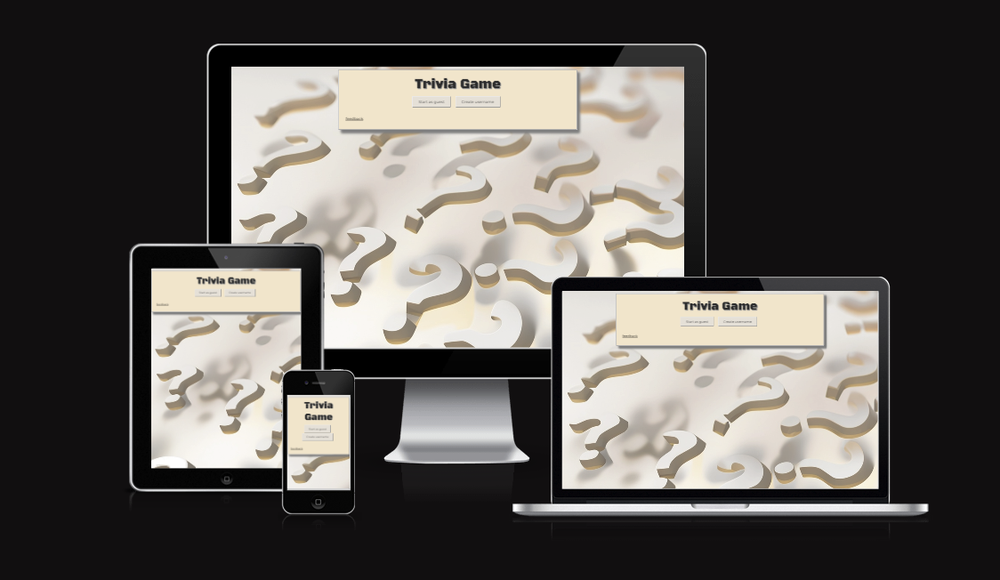

## Deployment
The webpage was deployed to GitHub Pages by following these steps:
* Go the the repository in GitHub
* Click on the Settings link on the top menu
* Select the Pages item on the left side menu
* Under Build and deployment, confirm that:
    * Source = Deploy from a branch
    * Branch = main /(root)
    * Click Save
* GitHub will deploy the webpage and generate a link for public access
* You can still push updates to GitHub, the updates will be automatically deployed to the live webpage, you can check the last deployed time on the same Pages tab where the link for live page is provided

[Click here](https://aleksarc.github.io/game/) to access this webpage.

## References
- This app was built with asistance of Code Institute professors and mentor as deliverable for "Project 2" of the course "Diploma in Full Stack Software Development (E-commerce Applications)". I extend here my gratitude for such support and material provided.

- [Favicon](https://www.pngwing.com/en/free-png-zoqmo)

- [How to create a popup](https://www.w3schools.com/howto/howto_js_popup.asp)

## Credits

- Popup images from https://www.pinterest.ie/pin/663647695077190215/
- Background image from [Adobe Stock](https://stock.adobe.com/ie)